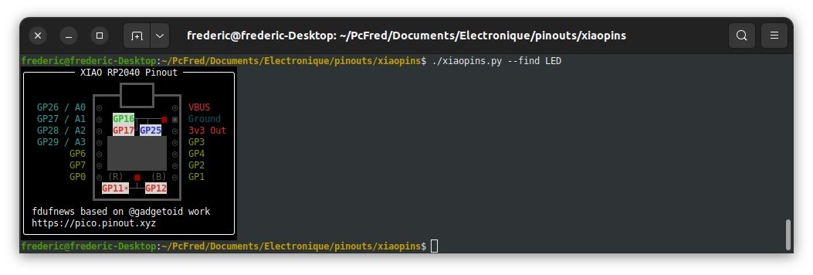

# pinouts
Pinouts of some development boards I am using

## Intro
My work is based on @gadgetoid work you can find at [https://github.com/pinout-xyz/picopins](https://github.com/pinout-xyz/picopins)

I like the idea of having access to the pinout of the boards I am working on at the command line

I kept the same look and feel as the one in the file I started from

I currently have the following boards:
- Raspberry Pi Pico (the one I started from)

- Seeed Studio Xiao RP2040



## Usage
```
usage: appName [--pins] [--all] or {spi,i2c,uart,pwm}
       --pins - show physical pin numbers
       --all or {spi,i2c,uart,pwm} - pick list of interfaces to show
       --hide-gpio - hide GPIO pins
       --find "<text>" - highlight pins matching <text>

appName can be one off picopins, xiaopins, ....
text can be spi, pwm, gpio, i2c, led

eg:    appName i2c  - show GPIO and I2C labels
       appName      - basic GPIO pinout
```

## Required
rich is required to display the pinouts.  
You can install rich with
> pip3 install rich
