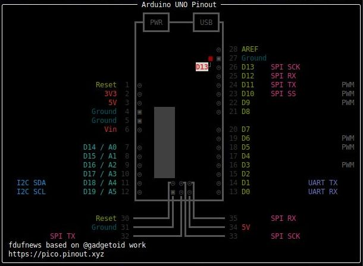
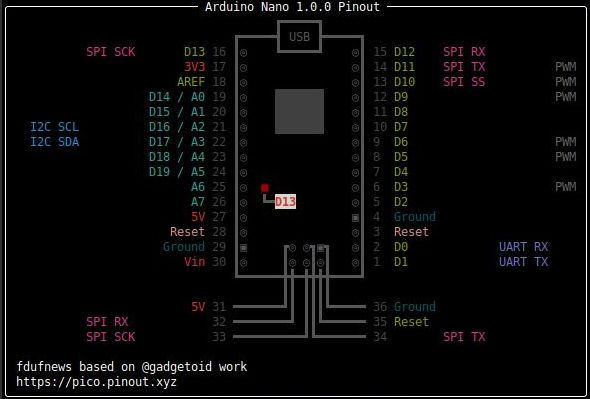

# pinouts
Pinouts of some development boards I am using

## Intro
I like the idea of having access to the pinout of the boards I am working on from the command line

My work is based on @gadgetoid work that you can find at [https://github.com/pinout-xyz/picopins](https://github.com/pinout-xyz/picopins)

I kept the same look and feel as the one in the file I started from

## What I have done
Starting from @gadgetoid work I spliced the code in 2 parts extracting the common code that displays the pinouts from the one that decribes the boards. It makes it a little easier to create new boards as all the specific parts are in one place and there is no code to change when adding a new board only some data.

I currently have made pinouts for the following boards:  
- Raspberry Pi Pico (the one I started from)

- Seeed Studio Xiao RP2040

- Arduino UNO

- Arduino Nano

- Arduino Pro Mini


## Usage
```
usage: appName [--pins] [--all] or {spi,i2c,uart,pwm}
       --pins - show physical pin numbers
       --all or {spi,i2c,uart,pwm} - pick list of interfaces to show
       --hide-gpio - hide GPIO pins
       --find "<text>" - highlight pins matching <text>

appName can be one off picopins, xiaopins, ....
text can be spi, pwm, gpio, i2c, led

eg:    appName i2c  - show GPIO and I2C labels
       appName      - basic GPIO pinout
```

## Required
rich is required to display the pinouts.  
You can install rich with
> pip3 install rich
