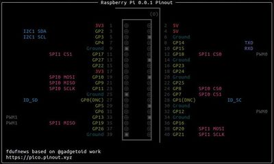

# pinouts
Pinouts of some development boards I am using

## Intro
I like the idea of having access to the pinout of the boards I am working on from the command line

My work is based on @gadgetoid work that you can find at [https://github.com/pinout-xyz/picopins](https://github.com/pinout-xyz/picopins)

I kept the same look and feel as the one in the file I started from

## What I have done
Starting from @gadgetoid work I spliced the code in 2 parts extracting the common code that displays the pinouts from the one that decribes the boards. It makes it a little easier to create new boards as all the specific parts are in one place and there is no code to change when adding a new board only some data.

I currently have made pinouts for the following boards:  

|   |   |
|:---:|:---:| 
|[](doc/picopins.jpg)|[](doc/xiaopins.jpg)|
|[Raspberry Pi Pico](doc/picopins.jpg)|[xiao RP2040](doc/xiaopins.jpg)|
|[](doc/unopins.jpg)| [](doc/nanopins.jpg)|
|[Arduino Uno](doc/unopins.jpg)| [Arduino Nano](doc/nanopins.jpg)
|[](doc/prominipins.jpg)|[](doc/teensylcpins.jpg)|
|[Arduino Pro Mini](doc/prominipins.jpg)|[Teensy LC](doc/teensylcpins.jpg)|
|[](doc/raspipins.jpg) |  |
|[Raspberry Pi](doc/raspipins.jpg) |  |

## Usage
```
usage: appName [--pins] [--all] or {spi,i2c,uart,pwm}
       --pins - show physical pin numbers
       --all or {spi,i2c,uart,pwm} - pick list of interfaces to show
       --hide-gpio - hide GPIO pins
       --find "<text>" - highlight pins matching <text>

appName can be one of picopins, xiaopins, ....
text can be spi, pwm, gpio, i2c, led

eg:    appName i2c  - show GPIO and I2C labels
       appName      - basic GPIO pinout
```
## How to make the pin description
There is a template that can be used to create new boards.  

1. Copy modelpins.py
1. Rename with a convenient name
1. Edit the file
    1. change the name of the class
    1. change the content of the PINOUT string.  
    Beware to keep the last line """.splitlines()[1:]] left aligned without any space in front otherwise you will get an error  
    Pins that are not ground, power, adc or run are considered gpio. There is no special requirement on the GPIO name.  
    Pins that are both analog and digital, can be identified this way: GP12 / A0. They will be colored differently than the only digital ones
    1. change the GROUND, POWER, ADC, RUN lists to reflect the pinout of the board.  
    If a list has no element it must be empty, RUN = ()  
    if a list has only one element it must be terminated with a comma, ADC = (23,)  
    1. change the name of the board, it is the name that will be displayed on top of the frame followed by the version number.  
    Don't forget to end the name with a space  
    1. change the LED list of lists. Each list describes one LED.
        - 1st item, row of the LED. The LED symbol in the diagram is a ▩ this symbol must not be changed has it is searched to be hightlghted. The row number starts from 0 at the top of the diagram in PINOUT.
        - 2nd item, row of the GPIO that drives the LED
        - 3rd item, the name of the GPIO
        - 4th item, the name of the color used to blink the GPIO, one of (highlight_r, highlight_g, highlight_b)
        - Ex 1: Case when there is only one LED. Beware the comma after this unique element  
            - LED = ((3, 4, "GP25","highlight_r"),)  
        - Ex 2: Case when there is more than one LED or special LEDs (see xiaopins.py).  
            First 3 lines describes an RGB LED. There is only one physical LED so the first argument is the same, 3. The GPIOs are on 2 different lines, so 3 or 4 for the second argument.  
            Next 2 lines decribes a SMART LED using 2 GPIOs    
            - LED = ((3, 3, "GP16","highlight_g"),  
            (3, 4, "GP17","highlight_r"),  
            (3, 4, "GP25","highlight_b"),  
            (8, 9, "GP11","highlight_r",  
            (8, 9, "GP12","highlight_r"))  
    1. if the name of the class has been changed, don't forget to change the name of the class line 74 where the instance is created

## Required
rich is required to display the pinouts.  
You can install rich with
> pip3 install rich
